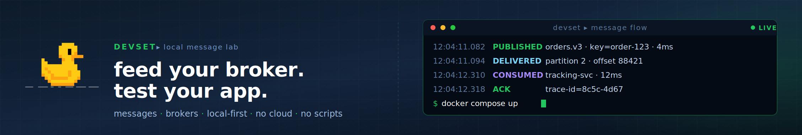
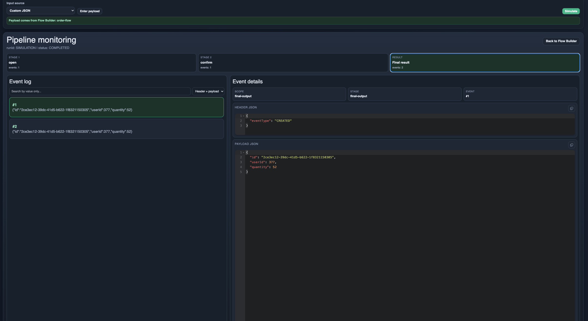
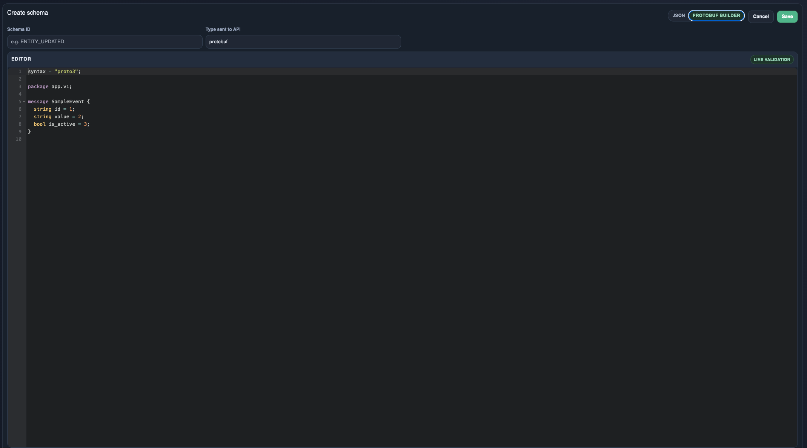

<p align="center">
  
</p>

<p align="center">
  <em>Local message lab for Kafka and RabbitMQ — no cloud, no scripts.</em>
</p>

<p align="center">
  <a href="LICENSE"></a>
  <a href="https://github.com/devset-io/devset-ce/releases"></a>
  <a href="https://github.com/devset-io/devset-ce/stargazers"></a>
  
  
</p>

# Devset

Testing event-driven systems is painful. You end up writing throwaway scripts to publish a few messages, integration tests are brittle and slow, multi-step scenarios need glue code nobody wants to maintain, and reproducing production payloads locally is a guessing game. Devset is a self-hosted scenario engine that compiles a declarative DSL into runs against real Kafka or RabbitMQ brokers, with a visual builder on top.

Think Postman or Cypress, but for Kafka and RabbitMQ instead of HTTP.

- **No cloud.** Runs entirely on your machine.
- **No accounts.** Open the UI and start.
- **No telemetry.** Your scenarios stay local.

<sub>Source-available under FSL-1.1 — free for internal use; each release converts to Apache 2.0 on its second anniversary.</sub>

---


---

## Quick start

### 1. Run Devset

```bash
docker run -p 8082:8082 -v devset-data:/data ghcr.io/devset-io/devset-ce:latest
```

Open **http://localhost:8082**.

### 2. Add a broker connection

Go to **Settings → Brokers → New connector**. Name it (e.g. `kafka-local`), point it at
your bootstrap servers (e.g. `localhost:9092`), and save. That name is the `producerName`
referenced everywhere below.

### 3. Send a single message

Open **Message Dispatch**. The UI is form-based — like Postman, but for Kafka and
RabbitMQ. Pick the broker connector, fill in the destination (topic, or exchange +
routing key), add headers if you need them, write the payload in the editor, hit
**Send**.

For the demo: pick `kafka-local`, set the topic to `user-events`, use `user-123` as the
key, and paste this as the payload:

```json
{ "userId": "user-123", "action": "OPEN" }
```

Headers are a free-form map passed through to the broker verbatim. Schemas are bound
through a dedicated field, not through a header. Saved requests and request history are
available from the side panels.

### 4. Run a multi-stage flow

Open **Flow Builder → New workflow** and paste:

```json
{
  "id": "user-signup-flow",
  "messageType": "KAFKA",
  "contentType": "application/json",
  "producerName": "kafka-local",
  "topic": "user-events",
  "executions": 1,
  "pipeline": [
    {
      "stage": "open",
      "event": "user-opened",
      "emit": true,
      "set": {
        "userId": "user-123",
        "action": "OPEN"
      }
    },
    {
      "stage": "wait-a-second",
      "event": "tick",
      "wait": "PT1S"
    },
    {
      "stage": "signup",
      "event": "user-signed-up",
      "emit": true,
      "repeat": 3,
      "set": {
        "userId": "user-123",
        "action": "SIGNUP",
        "email": "demo@example.com"
      }
    }
  ]
}
```

Save the workflow, then go to **Workflow Runners → New run**, pick `user-signup-flow`
and start it. The first message lands on `user-events`, a one-second wait elapses, and
then three signup messages are emitted in order — status and per-execution events show
up live in the run view.

---

## Features

Each item below maps to code that exists on this branch.

- Declarative workflow DSL with `stage`, `event`, `emit`, `set`, `state`, `repeat`,
  `repeatWhile`, `repeatUntil`, `wait` (ISO-8601), `headers`, `key`, `wireFormat`,
  `schemaId`, and `query` fields.
- Sends real messages to real Kafka and RabbitMQ brokers — selectable per workflow via
  `messageType: KAFKA | RABBIT`.
- JSON and Protobuf payload encoding via `contentType: application/json | application/x-protobuf`.
- Visual flow builder backed by the same DSL the engine executes.
- Workflow simulation that returns generated events without dispatching to a broker
  (`POST /engine/simulate`).
- Run lifecycle endpoints: submit, list, get status, stream events, stop
  (`/engine/runs/...`).
- WebSocket live tailing of Kafka topics at `/ws/kafka/topic-stream`.
- Local schema store for JSON and Protobuf, with in-process Protobuf descriptor parsing
  (no external schema registry client).
- Database query step (`query` block on a stage) backed by a MongoDB connector module.
- SQLite persistence — no external database to operate.
- Local-first: data lives in the `/data` volume; nothing leaves the machine.

---

## Screenshots

<table>
<tr>
<td></td>
<td></td>
</tr>
<tr>
<td align="center"><sub>Flow Builder — visual workflow canvas</sub></td>
<td align="center"><sub>Message Dispatch — single message send</sub></td>
</tr>
<tr>
<td></td>
<td></td>
</tr>
<tr>
<td align="center"><sub>Playground — simulate a workflow without dispatching</sub></td>
<td align="center"><sub>Schema Repo — Protobuf schemas</sub></td>
</tr>
<tr>
<td></td>
<td></td>
</tr>
<tr>
<td align="center"><sub>JSON/DSL editor used inside Flow Builder</sub></td>
<td align="center"><sub>Function Studio — payload field overrides (embedded in Message Dispatch)</sub></td>
</tr>
<tr>
<td colspan="2"></td>
</tr>
<tr>
<td colspan="2" align="center"><sub>Database query step — embedded inside Flow Builder</sub></td>
</tr>
</table>

---

## Repository layout

| Path | Component | Stack |
|---|---|---|
| `devset-ce-be/` | Backend (REST API + engine) | Java 25, Spring Boot 3.5.13, Gradle |
| `devset-ce-fe/` | Frontend (UI) | React 19, TypeScript 5.9, Vite 8 |
| `landing-page/` | Static landing page | HTML/CSS |
| `docs/images/` | Banner and product screenshots | — |
| `docker-compose.yml` | Local Kafka + RabbitMQ stack | Confluent cp-kafka 7.9, RabbitMQ 4.1 |

---

## Development setup

### Prerequisites

- **Java 25** (Eclipse Temurin recommended) — backend toolchain pinned in
  `devset-ce-be/build.gradle`.
- **Node.js 22** — what release CI uses; older 20.x will likely work, untested.
- **Docker** — only required for the prebuilt image or local Kafka/RabbitMQ.
- **protoc 34.1** — only needed if you compile Protobuf descriptors outside the Docker
  image (the image ships its own protoc).

### Backend

```bash
cd devset-ce-be
./gradlew build
./gradlew bootRun --args='--spring.profiles.active=dev'
```

The backend serves on **http://localhost:8082**. The `dev` profile points SQLite at
`devset-ce-be/data/devset.db` instead of `/data/devset.db` so you don't need a root
volume.

### Frontend

```bash
cd devset-ce-fe
npm install
npm run dev
```

The Vite dev server runs on **http://localhost:5173** and talks to the backend on
`:8082`. CORS for that origin is allowed by default
(`devset.cors.allowed-origins` in `application.yml`).

### Building a single JAR with the UI bundled

For production, the frontend's static build is copied into the backend's
`src/main/resources/static/` directory and served by Spring Boot from the same port as
the API. This is exactly what the release pipeline does
(`.github/workflows/release.yml`).

```bash
# 1. Build the frontend
cd devset-ce-fe
npm ci
npm run build

# 2. Copy the build into the backend's static resources
cd ..
mkdir -p devset-ce-be/src/main/resources/static
cp -r devset-ce-fe/dist/* devset-ce-be/src/main/resources/static/

# 3. Build the JAR
cd devset-ce-be
./gradlew bootJar

# 4. Build and run the Docker image
docker build -t devset-ce .
docker run -p 8082:8082 -v devset-data:/data devset-ce
```

The resulting image is based on `eclipse-temurin:25-jdk`, runs as a non-root `app` user,
bundles `protoc 34.1`, and persists data to the `/data` volume.

### Local Kafka and RabbitMQ via Docker Compose

The bundled `docker-compose.yml` brings up:

- Confluent `cp-kafka:7.9.0` — host port `9092`, in-network `kafka:29092`
- `rabbitmq:4.1-management-alpine` — AMQP on `5672`, management UI on `15672`
- A `devset` service entry that expects a locally built image

The `devset` service uses `build: devset-ce`, which is **not** the actual backend folder
(`devset-ce-be`). The simplest path is to ignore that service and run Devset from the
published image alongside compose's brokers:

```bash
# Brokers only
docker compose up kafka rabbitmq

# Then in a separate shell
docker run -p 8082:8082 -v devset-data:/data \
  --network devset-ce_default \
  -e SPRING_KAFKA_BOOTSTRAP_SERVERS=kafka:29092 \
  ghcr.io/devset-io/devset-ce:latest
```

---

## Configuration

The backend is configured through `devset-ce-be/src/main/resources/application.yml` and
Spring profile overrides. Only the keys listed below are read by the application.

| Property | Default | Source |
|---|---|---|
| `server.port` | `8082` | `application.yml` |
| `spring.datasource.url` | `jdbc:sqlite:/data/devset.db` | `application.yml` |
| `spring.kafka.bootstrap-servers` | `localhost:29092` | `application.yml` |
| `devset.cors.allowed-origins` | `http://localhost:5173` | `application.yml`; consumed by `CorsConfig` and `WebSocketConfig` |
| `devset.engine.max-active-runs` | `10` | enforced in `ExecutionAsyncProperties` |
| `devset.engine.max-executions-per-run` | `10` | enforced in `ExecutionAsyncProperties` |
| `devset.monitoring.resources.enabled` | `true` | toggles `ResourceUsageLoggingTask` |
| `devset.monitoring.resources.interval-ms` | `30000` | resource-usage log interval |
| `devset.monitoring.resources.initial-delay-ms` | `10000` | resource-usage log startup delay |

All `devset.*` keys map to a real binding or `@ConditionalOnProperty` in the code.

---

## REST API surface

The backend exposes 12 controller groups. Base paths:

| Path | Module | Purpose |
|---|---|---|
| `/collection` | `collection` | Manage saved request collections |
| `/single-requests` | `singlerequest` | CRUD saved single-message requests |
| `/single-step` | `singlestep` | Execute one ad-hoc step + history |
| `/workflows` | `workflow` | CRUD workflow DSL definitions |
| `/engine` | `engine` | Execute / simulate workflows, run lifecycle |
| `/schemas` | `schema` | Local JSON and Protobuf schema store |
| `/kafka` | `kafka` | Send messages, list topics, fetch recent messages |
| `/rabbit`, `/rabbit/message` | `rabbit` | Send messages, list broker resources |
| `/connectors/configurations` | `connector` | Broker connector configs |
| `/db/connectors/configurations` | `dbconnector` | Database connector configs |
| `/mongodb` | `mongodb` | Query and describe MongoDB collections |
| `/ws/kafka/topic-stream` | `kafka` | WebSocket — live Kafka topic stream |

---

## Tests

```bash
# Backend — unit tests
cd devset-ce-be && ./gradlew test

# Backend — integration tests (uses Testcontainers, requires Docker)
cd devset-ce-be && ./gradlew integTest

# Frontend
cd devset-ce-fe && npm test
```

---

## License

Devset is source-available under the
[Functional Source License 1.1 — Apache 2.0 Future License](LICENSE)
(`FSL-1.1-Apache-2.0`).

- You can use, modify, and self-host Devset for any **Permitted Purpose**: internal
  use, non-commercial education or research, and professional services to licensees.
- You cannot offer it as a competing commercial product or service.
- Each released version automatically converts to
  [Apache 2.0](https://www.apache.org/licenses/LICENSE-2.0) on the second anniversary of
  its release date.

This is not an OSI-approved open-source license. See [LICENSE](LICENSE) for the binding
text and [NOTICE](NOTICE) for copyright.

## Contributing

Contributions are welcome. See [CONTRIBUTING.md](CONTRIBUTING.md).

## Security

To report a security issue, see [SECURITY.md](SECURITY.md).
