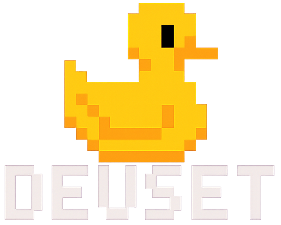

<p align="center">
  
</p>

<h3 align="center">Devset CE</h3>
<p align="center"><em>Explore, simulate, and test event flows – open-source, developer-friendly</em></p>

<p align="center">
  
  
  
  
  
</p>

## About the Project

Devset CE (Community Edition) is an open-source tool designed to simplify testing and working with event-driven systems
such as **Apache Kafka** and other compatible brokers. The goal is to help developers quickly **connect**, **explore**,
and **send test messages** using reusable schemas and configurable message flows.

> ⚠️ This is an early, minimal version focused on core functionality — especially message sending and schema handling.
> More features are being developed continuously.

> 📘 Note: Documentation is a work in progress and will be extended over time. Contributions are welcome!

## Features (Current)

- ✅ **Connect to Kafka brokers** – configure bootstrap servers and test the connection.
- ✅ **Send test messages** – manually or using configurable rules and intervals.
- ✅ **Load and view schemas** – import reusable message schemas (based on JSON).
- ✅ **Create topics** – define and create new topics directly from the UI.
- ✅ **Message headers** – configure custom headers for each message.

### Planned (Upcoming)

- ⏳ Edit topics (partial UI already exists)
- ⏳ Integration with Schema Registry
- ⏳ Multi-cluster support and history tracking
- ⏳ Visual flow editor for building advanced test scenarios

## System Requirements

- Java 21 or newer
- Access to a running Kafka cluster or compatible broker

## Installation

### From Source Code

```bash
# Clone the repository
git clone https://github.com/dominikmart/devset-ce.git
cd devset-ce

# Build the project
gradle build

# Run the application
java -jar build/libs/devset-ce.jar
```

### From Release Package

Download the latest version from the [Releases](https://github.com/dominikmart/devset-ce/releases) section and run:

```bash
java -jar devset-ce.jar
```

## Quick Start

1. **Connect to Kafka** – provide the bootstrap server address (e.g., `localhost:9092`)
2. **Browse or load schemas** – define message structure via JSON Schema
3. **Send messages** – select topic, attach schema, and test delivery

## Project Structure

- `adapters/` – connectors to external systems (Kafka, etc.)
- `application/` – JavaFX + Spring Boot entry point and logic
- `domain/` – domain model and core business logic
- `configuration/` – configuration, services, and technology stack

## Flow Editor

The flow editor allows you to build complex test scenarios by defining message sequences, conditions, and
transformations. This feature is in early development and will be expanded in future releases.

## 🤝 Contributing

We welcome contributions from the community!  
Help shape Devset CE into a powerful tool for testing event-driven systems.

### 💬 Join the Community

Want to ask questions, discuss features, or contribute in real-time?  
👉 [Join our Discord Server](https://discord.gg/S9kX3geFYE)

---

### How to Contribute

1. Fork the repository
2. Create a feature branch:
   ```bash
   git checkout -b feature/some-feature
   ```
3. Commit your changes:
   ```bash
   git commit -m 'Implement feature'
   ```
4. Push and open a pull request

### Reporting Bugs

- Provide detailed steps to reproduce the issue
- Describe the expected vs. actual behavior
- Include relevant logs and system details

### Feature Requests

- Open an issue labeled `enhancement`
- Clearly explain the motivation and value

### Documentation

- Keep docs concise, clear, and consistent
- Update or improve `README.md` and other markdown files as needed

## License

This project is licensed under the GNU General Public License v3.0 – see the [LICENSE](LICENSE) file for details.

## Author

Dominik Martyniak

## Acknowledgments

- [Spring Framework](https://spring.io/)
- [Apache Kafka](https://kafka.apache.org/)
- Everyone contributing to better developer tooling ❤️
